# PhotoManager - Technical Details

## Overview

PhotoManager is a comprehensive photo management application built with Swift and SwiftUI for macOS, with planned support for iPhone and iPad. The application enables users to organize, browse, and manage large photo collections with advanced features including duplicate detection, EXIF data extraction, metadata management, and hierarchical browsing.

## Architecture

### High-Level System Architecture


### Platform & Technology Stack

- **Language**: Swift 5.9+
- **UI Framework**: SwiftUI (declarative UI)
- **Target Platforms**: 
  - macOS 14.0+ (currently implemented)
  - iOS/iPadOS (planned)
- **Database**: SQLite with SQLite.swift library
- **Image Processing**: ImageIO (native macOS framework)
- **Security**: CryptoKit for file hashing
- **Concurrency**: Swift async/await and Combine framework
- **Data Synchronization**: iCloudKit (planned for cross-device sync)

### Application Structure

The application follows a modern SwiftUI architecture with clear separation of concerns:

```
PhotoManager/
├── PhotoManagerApp.swift           # App entry point and configuration
├── Models/
│   └── DatabaseModels.swift        # Data models and database schema
├── Services/
│   ├── DatabaseManager.swift       # SQLite operations
│   ├── FileScanningService.swift   # File discovery and EXIF extraction
│   ├── ThumbnailService.swift      # Thumbnail generation and caching
│   └── PhotoLibrary.swift          # Main service coordinator
└── Views/
    ├── ContentView.swift            # Main application layout
    ├── DirectorySidebarView.swift   # Directory hierarchy view
    ├── TimelineSidebarView.swift    # Date-based browsing
    ├── DuplicatesSidebarView.swift  # Duplicate detection interface
    ├── PhotoGridView.swift          # Photo grid with infinite scroll
    ├── PhotoDetailView.swift        # Full photo viewer with EXIF
    ├── FilteredSearchView.swift     # Advanced search interface
    ├── SearchResultsView.swift      # Basic search results
    ├── SettingsView.swift           # Application settings
    └── DatabaseDebugView.swift      # Debug SQL console
```

## Core Components

### Component Interaction Diagram


### 1. Data Models

#### RootDirectory
Represents a managed photo directory in the system.

**Properties:**
- `id`: Unique identifier (Int64)
- `path`: Absolute file system path
- `name`: User-friendly directory name
- `isActive`: Active/inactive flag
- `createdAt`: Directory addition timestamp
- `lastScannedAt`: Last scan timestamp
- `bookmarkData`: Security-scoped bookmark data for sandboxed access

#### PhotoFile
Represents an individual photo with comprehensive metadata.

```mermaid
classDiagram
    class RootDirectory {
        +Int64? id
        +String path
        +String name
        +Bool isActive
        +Date createdAt
        +Date? lastScannedAt
        +Data? bookmarkData
    }
    
    class PhotoFile {
        +Int64? id
        +Int64 rootDirectoryId
        +String relativePath
        +String fileName
        +String fileExtension
        +Int64 fileSize
        +String fileHash
        +Date createdAt
        +Date modifiedAt
        +Date? exifDateTaken
        +String? exifCameraModel
        +String? exifLensModel
        +Double? exifFocalLength
        +Double? exifAperture
        +Int? exifIso
        +String? exifShutterSpeed
        +Int? imageWidth
        +Int? imageHeight
        +Bool hasThumbnail
        +String? thumbnailPath
        +String? userDescription
        +String? userTags
        +String fullPath()
    }
    
    class DuplicateGroup {
        +String fileHash
        +PhotoFile[] files
        +Int64 totalSize
        +Int duplicateCount()
    }
    
    RootDirectory "1" --> "*" PhotoFile : contains
    DuplicateGroup "1" --> "2..*" PhotoFile : groups
```



**Properties:**
- `id`: Unique identifier (Int64)
- `rootDirectoryId`: Foreign key to root directory
- `relativePath`: Path relative to root directory
- `fileName`: File name with extension
- `fileExtension`: Lowercase file extension
- `fileSize`: File size in bytes
- `fileHash`: SHA256 hash for duplicate detection
- `createdAt`: File creation date
- `modifiedAt`: File modification date
- **EXIF Metadata:**
  - `exifDateTaken`: Original photo capture date
  - `exifCameraModel`: Camera make and model
  - `exifLensModel`: Lens information
  - `exifFocalLength`: Focal length in mm
  - `exifAperture`: F-number
  - `exifIso`: ISO sensitivity
  - `exifShutterSpeed`: Exposure time (formatted string)
  - `imageWidth`: Image width in pixels
  - `imageHeight`: Image height in pixels
- **User Metadata:**
  - `userDescription`: User-provided photo description
  - `userTags`: Comma-separated tags
- **Thumbnail Info:**
  - `hasThumbnail`: Thumbnail generation status
  - `thumbnailPath`: Path to cached thumbnail

#### DuplicateGroup
Groups photos with identical file hashes.

**Properties:**
- `fileHash`: SHA256 hash shared by all files
- `files`: Array of duplicate PhotoFile objects
- `totalSize`: Combined size of all duplicates
- `duplicateCount`: Number of duplicate files

### 2. Service Layer


#### DatabaseManager
Singleton service managing all SQLite database operations.

**Key Responsibilities:**
- Database initialization and schema creation
- Schema migration for version upgrades
- CRUD operations for root directories and photos
- Search queries with filtering
- Duplicate detection queries
- Transaction management

**Notable Features:**
- Automatic schema migration (adds missing columns)
- Foreign key constraints with cascade delete
- Optimized indices for search and filtering
- Security-scoped bookmark storage
- Raw SQL execution for debugging

#### FileScanningService
Handles file system traversal and metadata extraction.

**Key Responsibilities:**
- Recursive directory scanning
- Image file discovery (supports JPEG, PNG, TIFF, HEIC, RAW formats)
- EXIF data extraction using ImageIO
- SHA256 hash calculation
- Fast scan mode (incremental updates)
- Full scan mode (complete refresh)

**Scanning Modes:**
- **Fast Scan**: Only processes new or modified files (based on file size and modification date)
- **Full Scan**: Clears existing data and reprocesses all files

**Security Features:**
- Security-scoped bookmark resolution for sandboxed access
- Proper resource management (start/stop security scope access)

#### ThumbnailService
Manages thumbnail generation and caching.

**Key Responsibilities:**
- Generate thumbnails at configurable sizes
- Cache thumbnails to disk
- Retrieve cached thumbnails
- Batch thumbnail generation for directories
- Thumbnail regeneration support

**Caching Strategy:**
- Thumbnails stored in: `~/Library/Application Support/PhotoManager/Thumbnails/`
- Organized by SHA256 hash of original file
- JPEG format with compression
- Persistent across app launches

#### PhotoLibrary
Central coordinator service bridging UI and backend services.

**Key Responsibilities:**
- Coordinate scanning operations
- Manage loading state and error handling
- Provide reactive data updates via `@Published` properties
- Group photos by date (year/month/day hierarchies)
- Aggregate duplicate groups
- Handle photo metadata updates
- Coordinate thumbnail generation

**Published Properties:**
- `rootDirectories`: Observable list of managed directories
- `duplicateGroups`: Observable list of duplicates
- `isLoading`: Loading state indicator
- `errorMessage`: User-facing error messages
- `thumbnailsUpdated`: Trigger for UI thumbnail refresh

### 3. View Layer

#### ContentView
Main application window with three-panel layout:
- **Left Panel**: Sidebar with directory/timeline/duplicates navigation
- **Center Panel**: Photo grid or search results
- **Right Panel**: Photo detail view with metadata

**Features:**
- Resizable split view panels
- Toolbar with search controls
- Mode switching (directory/timeline/duplicates/search)
- Advanced search filter panel

#### DirectorySidebarView
Hierarchical directory browser.

**Features:**
- Add/remove root directories
- Rescan directories
- Show photo counts per directory
- Expand/collapse directory tree
- Selection management

#### TimelineSidebarView
Date-based photo organization.

**Features:**
- Group by year, month, or day
- Collapsible year/month hierarchies
- Photo count indicators
- Representative thumbnail previews
- Date range navigation

#### DuplicatesSidebarView
Duplicate detection and management.

**Features:**
- List duplicate groups by file hash
- Show space savings potential
- Expandable duplicate file lists
- Individual file deletion
- Path display for each duplicate

#### PhotoGridView
Main photo display with grid layout.

**Features:**
- Lazy-loaded grid with infinite scroll (50 photos per batch)
- Adjustable thumbnail size (100-400px slider)
- Thumbnail metadata overlay:
  - Filename
  - Date taken
  - Image dimensions
  - Camera model
  - Exposure details (aperture, shutter, ISO, focal length)
  - User tags
- Click to open detail view

#### PhotoDetailView
Full-resolution photo viewer.

**Features:**
- Full image display with zoom and scroll
- Click to open fullscreen viewer
- Fullscreen mode with pinch-to-zoom (50%-500%)
- Zoom controls (-, reset, +)
- Comprehensive EXIF metadata panel
- Editable description and tags with save button
- All metadata displayed in organized sections

#### FilteredSearchView
Advanced search with multiple filter criteria.

**Features:**
- Text search (filename, description, tags)
- Date range filters (start/end date)
- Camera model filter
- Aperture range filter (min/max)
- ISO range filter (min/max)
- Real-time result updates
- Result count display
- Adjustable thumbnail size

#### SearchResultsView
Basic text search results.

**Features:**
- Simple text search across filename, path, description, tags
- Result count
- Clear search button
- Same grid layout as main view

### 4. Database Schema


#### root_directories Table
```sql
CREATE TABLE root_directories (
    id INTEGER PRIMARY KEY AUTOINCREMENT,
    path TEXT UNIQUE NOT NULL,
    name TEXT NOT NULL,
    is_active BOOLEAN DEFAULT 1,
    created_at TIMESTAMP DEFAULT CURRENT_TIMESTAMP,
    last_scanned_at TIMESTAMP,
    bookmark_data BLOB
);
```

#### photo_files Table
```sql
CREATE TABLE photo_files (
    id INTEGER PRIMARY KEY AUTOINCREMENT,
    root_directory_id INTEGER NOT NULL,
    relative_path TEXT NOT NULL,
    file_name TEXT NOT NULL,
    file_extension TEXT NOT NULL,
    file_size INTEGER NOT NULL,
    file_hash TEXT NOT NULL,
    created_at TIMESTAMP NOT NULL,
    modified_at TIMESTAMP NOT NULL,
    exif_date_taken TIMESTAMP,
    exif_camera_model TEXT,
    exif_lens_model TEXT,
    exif_focal_length REAL,
    exif_aperture REAL,
    exif_iso INTEGER,
    exif_shutter_speed TEXT,
    image_width INTEGER,
    image_height INTEGER,
    has_thumbnail BOOLEAN DEFAULT 0,
    thumbnail_path TEXT,
    user_description TEXT,
    user_tags TEXT,
    FOREIGN KEY(root_directory_id) REFERENCES root_directories(id) ON DELETE CASCADE
);
```

#### Database Indices
```sql
CREATE INDEX idx_photo_hash ON photo_files(file_hash);
CREATE INDEX idx_photo_root_dir ON photo_files(root_directory_id);
CREATE INDEX idx_photo_date_taken ON photo_files(exif_date_taken);
CREATE INDEX idx_photo_relative_path ON photo_files(relative_path);
CREATE INDEX idx_photo_user_description ON photo_files(user_description);
CREATE INDEX idx_photo_user_tags ON photo_files(user_tags);
```

## Feature Implementations

### Photo Scanning Workflow


### Search and Filter Flow


### Duplicate Detection Algorithm


### 1. Directory Management
- Add directories via native file picker with security-scoped bookmarks
- Store bookmarks for persistent sandboxed access
- Display directory hierarchy with photo counts
- Remove directories with cascade deletion of photos and thumbnails
- Track last scan timestamps

### 2. File Scanning
- Recursive directory traversal
- Support for common image formats: JPEG, PNG, TIFF, HEIC/HEIF, RAW (CR2, NEF, ARW, DNG, ORF, RW2)
- Two-pass scanning:
  1. File discovery and EXIF extraction
  2. Thumbnail generation
- SHA256 hashing for duplicate detection
- Progress tracking (current file, percentage complete)
- Background processing (off main thread)

### 3. EXIF Metadata Extraction
Uses native ImageIO framework to extract:
- Date and time original
- Camera make and model
- Lens model
- Focal length
- Aperture (F-number)
- ISO sensitivity
- Shutter speed (exposure time)
- Image dimensions (width × height)

### 4. Thumbnail Generation
- Configurable thumbnail size (default 200px)
- JPEG compression for storage efficiency
- Hash-based naming for deduplication
- Persistent disk cache
- Lazy generation (on-demand or batch)
- Background generation queue

### 5. Duplicate Detection
- SHA256 hash-based comparison
- Group duplicates by hash value
- Calculate space savings potential
- Show all file locations for each duplicate
- Individual deletion from database
- Files remain on disk (safe deletion)

### 6. Search & Filtering

#### Basic Search
- Text search across:
  - Filename
  - File path
  - User description
  - User tags
- Case-insensitive matching
- SQLite LIKE queries with wildcards
- Real-time results

#### Advanced Search
- Combine multiple filter criteria:
  - Text search (same as basic)
  - Date range (start/end dates)
  - Camera model (partial match)
  - Aperture range (min/max f-stop)
  - ISO range (min/max sensitivity)
- Filters applied sequentially
- Sort results by date (newest first)

### 7. User Metadata
- Editable description field (multi-line text)
- Editable tags field (comma-separated)
- Save button for metadata updates
- Immediate database persistence
- Display tags on photo thumbnails
- Search integration for description and tags

### 8. Photo Viewing

#### Grid View
- Lazy-loaded infinite scroll
- Adjustable thumbnail size (100-400px)
- Detailed metadata overlay on thumbnails
- Click to open detail view

#### Detail View
- Full-resolution image display
- Scrollable for large images
- Zoom and pan support
- Complete EXIF metadata panel
- Editable description and tags
- Click to open fullscreen mode

#### Fullscreen View
- Black background for distraction-free viewing
- Pinch-to-zoom gesture (50%-500% range)
- Zoom controls (+, -, reset buttons)
- Zoom percentage indicator
- Filename overlay
- Close button
- Scrollable viewport for zoomed images

### 9. Timeline Browsing
- Hierarchical date organization:
  - Year → Month → Day
  - Year → Week
  - Year → Month
- Collapsible year/month sections
- Photo counts at each level
- Representative thumbnail previews
- Use EXIF date when available, file creation date as fallback

### 10. Performance Optimizations
- **Lazy Loading**: Photos loaded in batches of 50
- **Background Processing**: File scanning and hashing off main thread
- **Database Indexing**: Optimized queries for common operations
- **Thumbnail Caching**: Persistent disk cache for fast access
- **Fast Scan Mode**: Incremental updates skip unchanged files
- **Reactive Updates**: Combine framework for efficient UI updates

### 11. Debug Features
- Database debug window with SQL console
- Execute raw SQL queries
- View query results in table format
- Column names and data types
- Keyboard shortcut: Cmd+Shift+D

## Data Persistence & Synchronization

### Current Implementation (macOS)
- **Local Storage**: SQLite database in `~/Library/Application Support/PhotoManager/`
- **Thumbnails**: Cached in `~/Library/Application Support/PhotoManager/Thumbnails/`
- **Persistent Access**: Security-scoped bookmarks for sandboxed access
- **Data Retention**: Full photo metadata, user annotations, and thumbnails persist across launches

### Planned Implementation (Multi-Platform)


#### iCloud Synchronization via iCloudKit
- **CloudKit Container**: Private database for user photos
- **Record Types**:
  - `RootDirectory`: Synced directory references
  - `PhotoMetadata`: Photo metadata without file data
  - `UserAnnotations`: Descriptions and tags
- **Conflict Resolution**: Last-write-wins with timestamp comparison
- **Selective Sync**: User can choose which directories sync to mobile devices
- **Asset Management**: CKAsset for thumbnail synchronization
- **Background Sync**: Silent push notifications for updates

#### iOS/iPadOS Implementation
- **SwiftUI**: Shared codebase with macOS
- **Adaptive Layouts**: Different layouts for iPhone/iPad/Mac
- **Photos Framework Integration**: Read-only access to user's Photos library
- **Document Picker**: Access external photo directories
- **File Provider**: Access cloud storage (iCloud Drive, Dropbox, etc.)
- **Thumbnail Management**: Lower resolution thumbnails on mobile
- **Offline Support**: Core functionality works without network

#### Cross-Platform Architecture
```
Shared/
├── Models/           # Data models (all platforms)
├── Services/         # Core services (all platforms)
└── ViewModels/       # Business logic (all platforms)

macOS/
└── Views/            # macOS-specific views

iOS/
└── Views/            # iOS-specific views

iPadOS/
└── Views/            # iPad-specific views (split view, etc.)
```

## Export Functionality (Planned)

### Export Architecture


### Export Process Flow


### Export Formats

#### 1. PDF Export
- **Layout**: Grid or list layout with thumbnails
- **Metadata**: Include EXIF data, descriptions, tags
- **Page Size**: Configurable (A4, Letter, etc.)
- **Orientation**: Portrait or landscape
- **Thumbnail Size**: Configurable
- **Sorting**: By date, name, or custom order
- **Filtering**: Export subset based on search/filter criteria

#### 2. JSON Export (Zip Archive)
**Archive Contents:**
- `metadata.json`: Complete photo metadata
- `images/`: Directory containing original images
- `thumbnails/`: Directory containing thumbnail images (optional)

**JSON Structure:**
```json
{
  "exported_at": "2025-11-05T21:46:40Z",
  "version": "1.0",
  "photos": [
    {
      "id": 12345,
      "filename": "IMG_1234.jpg",
      "path": "images/IMG_1234.jpg",
      "thumbnail_path": "thumbnails/IMG_1234_thumb.jpg",
      "file_size": 2458624,
      "file_hash": "a3b2c1...",
      "created_at": "2024-05-15T14:30:00Z",
      "modified_at": "2024-05-15T14:30:00Z",
      "exif": {
        "date_taken": "2024-05-15T14:30:00Z",
        "camera_model": "Canon EOS R5",
        "lens_model": "RF 24-105mm F4L IS USM",
        "focal_length": 50.0,
        "aperture": 4.0,
        "iso": 400,
        "shutter_speed": "1/250s",
        "image_width": 8192,
        "image_height": 5464
      },
      "user_metadata": {
        "description": "Sunset over the mountains",
        "tags": ["landscape", "sunset", "mountains"]
      }
    }
  ]
}
```

#### 3. HTML Export (Zip Archive)
**Archive Contents:**
- `index.html`: Main gallery page
- `css/style.css`: Stylesheet
- `js/gallery.js`: Interactive JavaScript
- `images/`: Original or resized images
- `thumbnails/`: Thumbnail images
- `data.json`: Photo metadata for JavaScript

**Features:**
- Responsive grid layout
- Lightbox viewer for full images
- EXIF overlay on hover
- Search and filter controls
- Thumbnail size adjustment
- Sort options (date, name, etc.)
- Tag filtering
- Date range filtering
- Fully self-contained (works offline)
- Mobile-friendly design

**HTML Structure:**
```html
<!DOCTYPE html>
<html>
<head>
    <title>Photo Gallery Export</title>
    <link rel="stylesheet" href="css/style.css">
</head>
<body>
    <header>
        <h1>Photo Gallery</h1>
        <div class="controls">
            <input type="text" id="search" placeholder="Search...">
            <select id="sort">
                <option>Date (Newest)</option>
                <option>Date (Oldest)</option>
                <option>Name (A-Z)</option>
            </select>
        </div>
    </header>
    <main id="gallery"></main>
    <script src="js/gallery.js"></script>
</body>
</html>
```

### Export Implementation Details

#### macOS-Only Features
- Full directory export
- Batch export to multiple formats simultaneously
- Custom export templates
- Export size optimization options
- Progress tracking for large exports

#### Export Options Dialog
- **Format Selection**: PDF, JSON, HTML
- **Image Quality**: Original, High, Medium, Low
- **Include Thumbnails**: Yes/No (for JSON/HTML)
- **Metadata Options**:
  - Include EXIF data
  - Include user descriptions
  - Include user tags
- **Filtering**:
  - Export all photos
  - Export filtered selection
  - Export date range
- **Destination**: Choose export directory

## File Format Support

### Read Support
- **JPEG**: .jpg, .jpeg
- **PNG**: .png
- **TIFF**: .tiff, .tif
- **HEIC/HEIF**: .heic, .heif (native macOS support)
- **RAW Formats**:
  - Canon: .cr2, .cr3
  - Nikon: .nef
  - Sony: .arw
  - Adobe: .dng
  - Olympus: .orf
  - Panasonic: .rw2
  - Fujifilm: .raf
  - Others: .raw

### RAW Format Notes
- RAW support depends on macOS system codecs
- ImageIO framework handles RAW decoding
- EXIF extraction works with all supported formats
- Some proprietary formats may have limited support

## Security & Privacy

### Sandboxing
- App Sandbox enabled for macOS App Store compliance
- Security-scoped bookmarks for persistent file access
- User explicitly grants access via file picker
- Bookmark data stored in database

### Data Privacy
- All data stored locally
- No analytics or telemetry
- No network requests (current implementation)
- User controls all data retention

### Future Considerations (iCloud)
- End-to-end encryption for synced metadata
- User controls sync settings
- Opt-in for cloud features
- Local-first architecture (cloud is optional)

## Performance Characteristics

### Performance Profile


### Scalability Test Results


### Scalability
- **Database**: SQLite handles millions of records efficiently
- **Lazy Loading**: UI remains responsive with 10,000+ photos
- **Indexing**: Optimized queries for common operations
- **Thumbnail Cache**: O(1) lookup for cached thumbnails

### Memory Management
- **Lazy Loading**: Only load visible photos
- **Image Caching**: Limited in-memory cache with LRU eviction
- **Background Processing**: File operations off main thread
- **Reactive Updates**: Efficient UI updates via Combine

### Typical Performance
- **Scanning**: ~100-200 photos/second (depends on EXIF complexity)
- **Hashing**: ~50-100 MB/second (depends on disk speed)
- **Thumbnail Generation**: ~10-20 thumbnails/second
- **UI Responsiveness**: 60 fps grid scrolling with lazy loading

## Future Enhancements

### Planned Features
1. **iCloud Synchronization**: Cross-device sync via CloudKit
2. **iOS/iPadOS Apps**: Native mobile apps with shared codebase
3. **Export Functionality**: PDF, JSON, HTML exports with images
4. **Batch Operations**: Multi-select and batch editing
5. **Smart Albums**: Automatic grouping by criteria
6. **Face Detection**: Photo organization by people
7. **Location Mapping**: GPS-based photo mapping
8. **Photo Editing**: Basic adjustments (crop, rotate, filters)
9. **Sharing**: Export to social media or email
10. **Backup & Restore**: Database backup functionality

### Possible Improvements
- Custom thumbnail sizes per view
- Tag autocomplete and suggestions
- Advanced duplicate management (similarity matching)
- Keyboard shortcuts for common actions
- Drag-and-drop photo organization
- Integration with external editors
- Batch EXIF editing
- Slideshows and presentations
- Print layouts
- Web gallery hosting

## Development Environment

### Requirements
- **macOS**: 14.0 (Sonoma) or later
- **Xcode**: 15.0 or later
- **Swift**: 5.9 or later

### Dependencies
- **SQLite.swift**: Type-safe SQLite wrapper
  - Version: Latest stable
  - License: MIT
  - Source: GitHub - stephencelis/SQLite.swift

### Build Configuration
- **Target**: macOS App
- **Deployment Target**: macOS 14.0
- **Architecture**: Universal (Apple Silicon + Intel)
- **Swift Language Mode**: Swift 5
- **Optimization**: Debug = No Optimization, Release = Optimize for Speed

### Testing Strategy
- Unit tests for service layer
- Integration tests for database operations
- UI tests for critical workflows
- Performance tests for large photo collections
- Edge case testing (corrupted files, missing EXIF, etc.)

## Troubleshooting & Debugging

### Common Issues

#### Permission Errors
- Grant Full Disk Access in System Preferences → Privacy & Security
- Ensure bookmark data is valid
- Check sandbox entitlements

#### Large Collections
- Initial scan may take minutes for 10,000+ photos
- Thumbnail generation happens progressively
- Database performance degrades minimally up to millions of records

#### RAW File Support
- Ensure macOS has necessary codec support
- Update macOS for latest RAW format support
- Some proprietary formats may not decode

### Debug Tools
- **Database Debug Window**: Execute raw SQL queries
- **Console Logs**: Detailed logging throughout app
- **Performance Instruments**: Profile with Xcode Instruments

### Logging
All services use unified logging with appropriate subsystems:
- `com.photomarger.database`: Database operations
- `com.photomarger.scanning`: File scanning
- `com.photomarger.photolibrary`: Photo library coordinator
- `com.photomarger.filter`: Search and filtering

View logs in Console.app or Terminal:
```bash
log stream --predicate 'subsystem == "com.photomarger"'
```

## License & Distribution

### License
This project is provided as-is for educational and personal use.

### Distribution Plans
- Direct download from developer website (current)
- Mac App Store (future, requires App Sandbox compliance)
- iOS App Store (future, for mobile versions)

---

**Document Version**: 1.0  
**Last Updated**: 2025-11-05  
**Application Version**: 1.0 (macOS)
